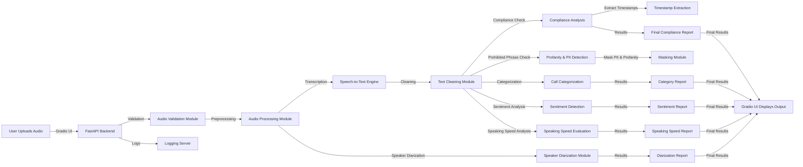

# *System Architecture Overview*

The architecture of this system follows a modular design that efficiently handles audio transcription, compliance analysis, and sentiment detection, while maintaining scalability and robustness. It is built using the following key components:

•⁠  ⁠*FastAPI*: For high-performance backend API interactions.

•⁠  ⁠*Gradio*: To provide a user-friendly interface for interaction.

•⁠  ⁠*Logging Server*: To capture and monitor system events for debugging and analysis.

---
## *System Architecture Diagram*

The following diagram illustrates the flow of data through the system:

---